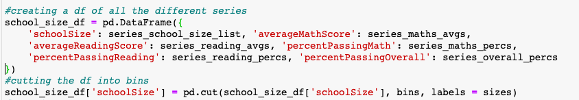
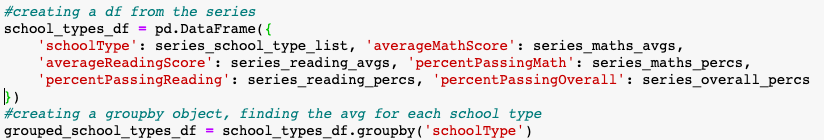

# pandas_challenge

### contains:
* PyCitySchools.ipynb
* schools_analysis.pdf

### description:

The goal of this analysis was to uncover trends within the reading and mathematics yearly exam scores from schools within a district in order to produce potential recommendations for budget allocations in future years.

The jupyter notebook PyCitySchools.ipynb therefore contains the following steps to reveal trends:
* Data Cleaning:
    * reading in two csvs as dataframes, one containing data on schools, the other containing student data (school_data, student_data respectively)
    * left merge the two dataframes in order to have data only on students connected to schools (schools_and_students_df)
* District-level summary:
    
    - number of schools: creating and finding the length of a list of schools (num_schools)
    - total number of students: finding the length of the 'Student ID' column (which contains unique values) in schools_and_students_df (num_students)
    - total budget: creating and finding the sum of a list of budgets (total_budget)
    - average mathematics exam score: finding the average of the math_scores column in schools_and_students_df (avg_maths)
    - average reading exam score: finding the average of the reading_scores column in schools_and_students_df (avg_reading)
    - percentage of students passing the mathematics exam: 
        - finding the length of the results of a boolean mask filtering for mathematics scores greater than or equal to 70 (students_passing_maths)
        - dividing the number of students passing by the number of students(students_passing_maths/num_students), multiplied times 100 to get a number of out 100.
    - percentage of students passing the reading exam: follows the same format as finding the percentage of students passing mathematics, with a boolean mask filtering for scores of 70 and above in reading (students_passing_reading) divided by total number of students
    - percentage of students passing both exams: follows a similar format as above, with a boolean mask filtering for scores 70 and above for both subjects (students_passing_both), divided by total number of students
    - creating the dataframe for display:
        - creating a dictionary of lists to hold the different values (summary_dict)
        - creating a dataframe out of the dictionary (district_summary_df)
        - creating a copy of district_summary_df to apply formatting 
        - applying formatting to district_summary_df_F, and displaying it

* School-level analysis:   
    * School-level summary:
         
        - creating empty lists to be populated with values for: school names, school type (district or charter), students per school, budget per school, budget per student, average mathematics score, average reading score, percent of students passing mathematics, percent of students passing reading, percent of students passing both subjects
        - defining a function (append_to_list) that takes in the name of a variable relating to a column in schools_and_students_df (my_var) and the list relating to that variable (my_var_list), and adds all rows that relate to that variable to the list
        - creating a grouped by object (grouped_schools_df) by grouping by school name on schools_and_students_df
        - using grouped_schools_df to access different columns and apply different functions for each needed variable:
            - school names: accessing 'school_name' column, and calling .unique(), calling append_to_list on the object (school_name) created
            - school types: accessing 'school_type' column, calling .unique(), and calling append_to_list on the object (school_type) created
            - total students per school: accessing 'Student ID' column, calling .count(), calling append_to_list on object 'total_students'
            - total budget per school: accessing 'budget' column, calling .unique(), explicitly defining data type as a number, calling append_to_list on object 'total_budget'
            - budget per student: dividing total_budget/total_students (to create 'budget_per_student' variable), calling append_to_list on result
            - average mathematics score: accessing 'math_score' column, calling .sum() to create 'maths_scores_sum', dividing it by 'total_students' to create 'avg_maths_score', calling append_to_list on object
            - average reading score: accessing 'reading_score' column, calling .sum() to create 'reading_scores_sum', dividing it by 'total_students' to create 'avg_reading_score', calling append_to_list on object
        - creating grouped by objects for only passing mathematics scores, only passing reading scores, only passing scores for both exams (grouped_maths, grouped_reading, grouped_overall): applying .count() to the relevant column ('maths_score', 'reading_score', either one for the third, since both columns would be the same length for the third grouped by object), dividing by total_students, multiplying by 100, explictly setting a numeric type, and calling append_to_list function
        - creating dataframe for display:
            - creating a dictionary to hold the lists (schools_dict)
            - creating a dataframe from the dictionary (schools_dict_df)
            - initial cleanup:
                - removing brackets from school name and school type columns
                - setting the school name column as the index
            - formatted copy:
                - copying the schools_dict_df for formatting (schools_dict_df_F)
                - adding commas, rounding, and dollar signs
    * Schools with five highest overall passing scores:
        
        - sorting schools_dict_df (the un-formatted school-level summary) by percent passing both exams
        - re-setting index so that a numeric index can be used to display top 5 schools
        - re-setting index as school name, saving as top_schools, displaying
    * Schools with five lowest overall passing scores: 
        
        - same procedure as above, but sorting in ascending order (saving as bottom_schools), so the first 5 indices will display the schools with lowest scores
    * Ranking schools: 
        - by overall passing scores: sorting the schools_dict_df by overall passing scores, and displaying all of the indices, so that patterns in schools in-between the top and bottom scoring schools can be seen
        
        - by school budget: sorting schools_dict_df by total budget to see if there is overlap between the ranking of schools by scores and by budget
        
    * Mathematics scores by grade:

        
        - creating empty lists for holding mathematics scores for all four years (9th grade, 10th grade, 11th grade, 12th grade), and the names of schools to correspond to each score
        - defining a function loop_creator to append to appropriate lists
        - calling the function for each year
        - creating a series for each year that holds the scores, with the index as the school names, and defining a numeric type
        - grouping each series by school name, and finding the average, and saving the results to the variables grouped9maths, grouped10maths, grouped11maths, and grouped12maths  
        - creating a dataframe (maths_scores_df) out of the grouped variables
    * Reading scores by grade: 

        
        - following the same steps as in the mathematics scores by grade, resulting in the dataframe reading_scores_df
    * School performance in exams based on school spending ranges:
        
        - finding quartiles of schools_dict_df's 'perStudentBudget' column to find sensible spending ranges to apply to the data
        - creating empty lists to append data for: spending amount in each school, mathematics scores, reading scores, percent passing mathematics, percent passing reading, percent passing both exams
        - defining the function loop_collector, which takes the minimum and maximum number for a spending range, and appends data to each empty list for schools in schools_dict_df that apply to that spending range
        - calling loop_collector on each spending range
        - creating series for each of the lists
        - creating a dataframe(spending_ranges_df) out of the series
        - applying pd.cut() to spending_ranges_df to divide the dataframe into the appropate bins
        - grouping spending_ranges_df by the spending ranges and finding the average of each bin's scores and percentages for each exam
    * School scores based on school size: 
        
        - the same procedure as for school spending ranges was done:
            - determining how many students constitutes a small, medium, or large school
            - creating empty lists for different exam scores and percentages
            - defining a loop_collector function
            - calling loop_collector for each size school
            - creating series for each list
            - creating a dataframe, school_size_df, out of the series
            - dividing the dataframe into bins using pd.cut()
            - grouping by school size, finding the mean scores and percentages for each bin
    * School scores based on school type (charter or district): 
        
        - creating empty lists for different exam scores and percentages
        - using a for loop to append to the lists
        - creating series for each list
        - creating a dataframe, school_types_df, out of the series
        - grouping by school type, calling .mean() on the whole dataframe, which applies the mean function to every column in the dataframe

### Observations/Procedural Explanations

The majority of the coding done in this notebook was repetitive: determining how to append information pertaining to one criterion (for example, mathematics scores, or school size), and applying that to other criteria (other exam scores, other school qualities). A shorter way of completing this analysis could be to create a function that takes in the name of the criterion, filters the data accordingly, and applies functions to only the filtered data. This could be done for the percent passing mathematics, percent passing reading, and percent passing both in the district summary; for the different grouped bys in the school summary; the bottom/top/ranked performing schools; scores by grade; school spending/school size scores breakdown.  

Setting of types was important in several instances throughout this notebook. Explicit numeric types are assigned to different series within the school-level summary, in order to ensure that mathematical operations can be done with them: in those instances the assumed type was string, meaning that those operations, such as finding the mean or sum, could not be done. Ensuring numerical operations could be done was also a factor in creating two versions of the data frames for the district summary and school level summary: one for formatting, and the other with no formatting. Once formatting occurs, the formatted values are set as strings, and cannot be re-set as floats/integers. To sidestep this issue, a non-formatted dataframe for each summary was created but not displayed, so that the dataframes could be used later within the notebook to do further calculations. 

The final three charts, looking at schools by their budgets, size, and type, display similar data: average exam scores and percentages passing exams. However, different methods are used to get at those averages and percentages. In school spending and size, a function is used to append data based on different defined ranges of spending or size, and pd.cut() is used to divide the dataframes into those ranges; for school type, a for loop is used, and pd.cut() is not used. The reason for these differences is that spending and size can be broken down by means of numbers, while school type is a qualitative difference. The function pd.cut() accepts numerical differentiations, which does not apply to the school type. Relatedly, for school size and spending, proper data appending requires separating the source dataframe by the defined numeric ranges. A for loop could be done multiple times, each time filtering by one range, but it is more efficient to use a function that takes each range. For school type, only one for loop is needed, so there is no need to create another function.   

  
  

*The method used to create a grouped dataframe for School Size vs. School Type.*

Further observations and conclusions can be found in the schools_analysis.pdf file. 